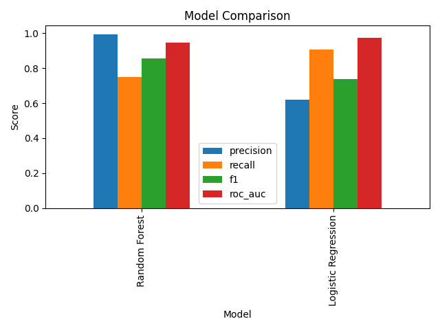
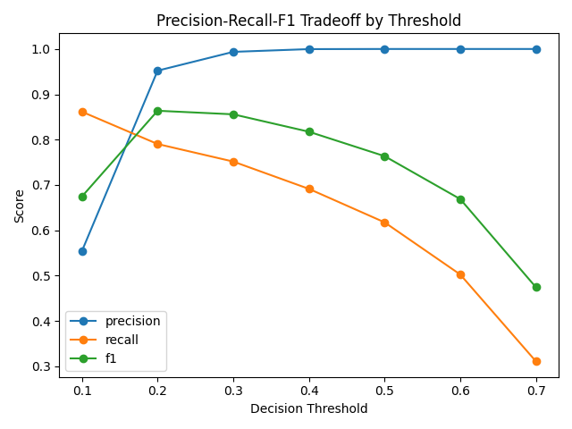
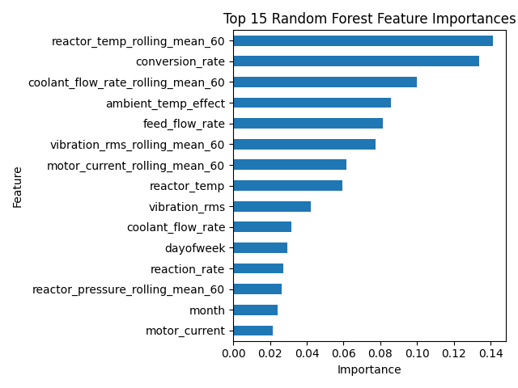
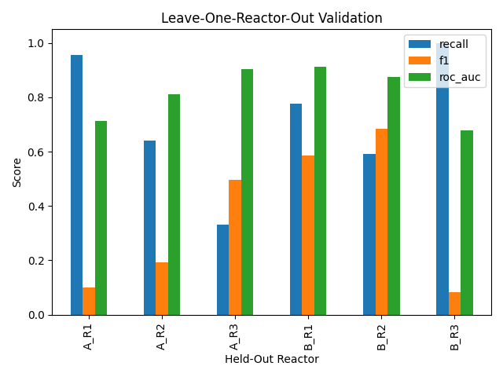
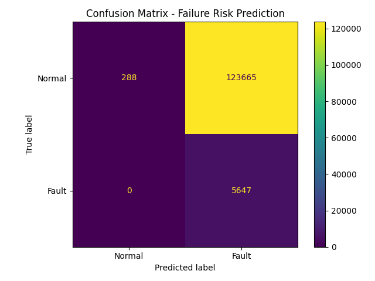
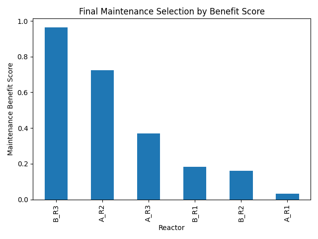

# AI-Assisted Predictive Maintenance Optimizer for Chemical Reactors

## Recruiter Summary

This project demonstrates my ability to combine Python, machine learning, time-series feature engineering, and binary optimization to solve an industrial maintenance decision problem.

The system predicts reactor failure risk from multivariate sensor data, aggregates predicted risk at the reactor level, and uses a binary optimization model to recommend preventive maintenance actions under technician-hour, downtime, and budget constraints.

## Project Overview

This project combines machine learning and mathematical optimization to support preventive maintenance decisions in industrial chemical reactor systems.

A machine learning model predicts reactor failure risk from multivariate process sensor data. The predicted risk is then aggregated at the reactor level and used inside an optimization model to decide which reactors should receive preventive maintenance under technician-hour, downtime, and budget constraints.

The project demonstrates an end-to-end industrial decision-support pipeline:

```text
sensor data → failure-risk prediction → reactor risk summary → maintenance optimization → final recommendation
```

The goal is not only to predict which reactors are risky, but also to recommend which reactors should be prioritized when maintenance resources are limited.

---

## Business Problem

Industrial plants often operate under limited maintenance resources. Not every reactor, machine, or production unit can be inspected or maintained immediately.

A useful maintenance decision-support system should answer questions such as:

- Which reactors are most likely to experience a fault?
- Which reactors have the highest expected efficiency loss?
- Which reactors are closest to a potential fault?
- Which reactors should be selected for preventive maintenance when resources are limited?

This project addresses the following decision problem:

> Given predicted failure risk, expected efficiency loss, and time-to-fault urgency, which reactors should be selected for preventive maintenance under technician-hour, downtime, and budget constraints?

---

## Dataset

The project uses a synthetic chemical process monitoring time-series dataset. The dataset simulates multiple chemical reactors operating under different regimes with realistic sensor behavior, gradual fault development, missing values, and process performance indicators.

The dataset includes:

- Timestamped sensor readings
- Multiple reactor IDs
- Operating regimes
- Ambient temperature effect
- Reactor temperature and pressure
- Feed and coolant flow rates
- Agitator speed
- Reaction rate
- Conversion rate
- Selectivity
- Yield percentage
- Vibration
- Motor current
- Power consumption
- Temperature and pressure setpoints
- Fault labels
- Efficiency loss percentage
- Time-to-fault information

The dataset used in this project is a synthetic chemical process monitoring time-series dataset.

The dataset can be downloaded from [Kaggle](https://www.kaggle.com/datasets/rohit8527kmr7518/chemical-process-monitoring-time-series-dataset).

To run the project, place the dataset in:

```text
data/raw/chemical_process_timeseries.csv
```

---

## Repository Structure

```text
predictive-maintenance-optimizer/
│
├── data/
│   ├── raw/
│   └── processed/
│
├── notebooks/
│   ├── 01_data_cleaning_eda.ipynb
│   ├── 02_failure_prediction_model.ipynb
│   ├── 03_maintenance_optimization.ipynb
│   └── 04_integrated_ml_optimization.ipynb
│
├── src/
│   ├── __init__.py
│   ├── data_preprocessing.py
│   ├── train_model.py
│   ├── optimize_maintenance.py
│   └── utils.py
│
├── outputs/
│   ├── figures/
│   └── results/
│
├── README.md
├── requirements.txt
├── .gitignore
└── main.py
```

---

## Project Workflow

The project follows six main steps:

1. Load and clean the raw chemical process dataset
2. Create time-based and rolling-window sensor features
3. Train machine learning models for failure-risk prediction
4. Evaluate the model using time-based and reactor-level validation
5. Aggregate predicted risk at the reactor level
6. Solve a binary optimization model for preventive maintenance selection

---

## Methodology

### 1. Data Cleaning and Preprocessing

The preprocessing stage includes:

- Loading the raw dataset
- Converting timestamps to datetime format
- Sorting observations by `reactor_id` and `timestamp`
- Creating a binary failure target
- Handling missing numeric sensor values using interpolation and forward/backward filling
- Creating time-based features
- Creating rolling-window sensor features

The binary target is defined as:

```text
failure_risk = 0 if fault_type = 0
failure_risk = 1 if fault_type ≠ 0
```

This converts the problem into a binary classification task: normal operation versus fault condition.

---

### 2. Feature Engineering

The model uses process and sensor features such as:

- `ambient_temp_effect`
- `reactor_temp`
- `reactor_pressure`
- `feed_flow_rate`
- `coolant_flow_rate`
- `agitator_speed_rpm`
- `reaction_rate`
- `conversion_rate`
- `selectivity`
- `yield_pct`
- `vibration_rms`
- `motor_current`
- `power_consumption_kw`
- `temp_setpoint`
- `pressure_setpoint`

Time-based features are also added:

- `hour`
- `dayofweek`
- `month`

Rolling-window features are created for selected sensor variables using a 60-minute window:

- rolling mean
- rolling standard deviation

These rolling features are useful because industrial faults often develop gradually through changes in sensor trends and variability.

---

## Machine Learning Approach

The failure prediction task is formulated as binary classification:

```text
0 = normal operation
1 = fault condition
```

Target-related columns are excluded from the feature set to avoid data leakage.

Excluded columns include:

- `fault_type`
- `failure_risk`
- `efficiency_loss_pct`
- `time_to_fault_min`
- `predicted_failure_risk`
- `predicted_failure_label`

Two models are compared:

1. Logistic Regression as an interpretable baseline model
2. Random Forest as a nonlinear model capable of capturing interactions between process variables

Because fault observations are imbalanced, accuracy alone is not sufficient. The model is evaluated using:

- Precision
- Recall
- F1-score
- ROC-AUC
- Confusion matrix

---

## Why Threshold Tuning Matters

In predictive maintenance, the classification threshold is important.

The default threshold is usually:

```text
0.50
```

However, in maintenance decision-making, missing a fault can be more expensive than inspecting a reactor unnecessarily. Therefore, a lower threshold may be preferred to increase recall.

This project evaluates different thresholds to compare:

- Precision
- Recall
- F1-score

A selected threshold is then used to convert predicted failure probabilities into binary failure-risk labels.

---

## Model Evaluation

The machine learning model is evaluated using several complementary strategies.

### 1. Time-Based Train/Test Split

The model is trained on earlier observations and tested on later observations. This simulates a realistic predictive maintenance setting where a model is trained on historical data and used to predict future risk.

### 2. Model Comparison

Logistic Regression is used as a baseline model, while Random Forest is used as the final nonlinear model.

The model comparison evaluates:

- Accuracy
- Precision
- Recall
- F1-score
- ROC-AUC

### 3. Threshold Analysis

Different probability thresholds are tested to understand the tradeoff between false alarms and missed failures.

### 4. Leave-One-Reactor-Out Validation

Each reactor is held out once as the test reactor, while the model is trained on all other reactors.

This validation strategy tests whether the model can generalize to an unseen reactor, which is important for industrial predictive maintenance systems.

## Model Performance

The final Random Forest model was evaluated using a time-based train/test split.

| Metric | Value |
|---|---:|
| Accuracy | 0.99 |
| Precision | 0.99 |
| Recall | 0.75 |
| F1-score | 0.85 |
| ROC-AUC | 0.94 |
---
The model achieves high precision and ROC-AUC, while recall remains lower than precision. This is important in predictive maintenance because recall reflects the model’s ability to identify risky observations. For maintenance decision-making, threshold tuning can be used to increase recall when missing failures is more costly than false alarms.

## Optimization Model

The optimization model converts machine-learning predictions into maintenance decisions.

Each reactor receives a maintenance benefit score based on:

- Predicted failure risk
- Expected efficiency loss
- Urgency from time-to-fault

The optimization model then selects reactors for preventive maintenance under limited resources.

---

## Maintenance Benefit Score

The maintenance benefit score combines three normalized components:

```text
maintenance_benefit =
0.50 × normalized predicted failure risk
+ 0.30 × normalized efficiency loss
+ 0.20 × normalized urgency
```

The weights reflect the following logic:

- Predicted failure risk receives the highest weight because the main goal is to prevent faults.
- Efficiency loss is included to reflect production performance impact.
- Urgency is included so reactors closer to a possible fault receive higher priority.

Urgency is calculated using the inverse of time-to-fault:

```text
urgency_score = 1 / (time_to_fault + 1)
```

This means that reactors with shorter time-to-fault receive higher urgency scores.

Zero or invalid time-to-fault values are handled carefully because they may represent missing or non-applicable timing information rather than immediate failure.

---

## Optimization Formulation

Let:

- `i` represent each reactor
- `x[i]` be a binary decision variable
- `b[i]` be the maintenance benefit score of reactor `i`
- `h[i]` be required maintenance hours
- `d[i]` be required downtime hours
- `c[i]` be maintenance cost

The decision variable is:

```text
x[i] = 1 if reactor i is selected for preventive maintenance
x[i] = 0 otherwise
```

The objective is to maximize total maintenance benefit:

```text
maximize sum(b[i] × x[i])
```

Subject to technician-hour capacity:

```text
sum(h[i] × x[i]) ≤ H
```

Subject to downtime limit:

```text
sum(d[i] × x[i]) ≤ D
```

Subject to maintenance budget:

```text
sum(c[i] × x[i]) ≤ C
```

Binary decision requirement:

```text
x[i] ∈ {0, 1}
```

Where:

- `H` is available technician hours
- `D` is allowed downtime
- `C` is available maintenance budget

---

## Maintenance Assumptions

Because the dataset does not include real maintenance cost, labor capacity, or downtime cost data, assumed planning parameters are used.

The current assumptions are:

```text
maintenance_hours per reactor = 3
downtime_hours per reactor = 2
maintenance_cost per reactor = 1000
available_technician_hours = 12
allowed_downtime_hours = 6
available_budget = 4000
```

These assumptions are not intended to represent a specific chemical plant. They are used to demonstrate how predicted failure risk can be converted into an optimization-based maintenance decision.

---

## Results

The final pipeline produces:

- Cleaned and processed data
- A trained failure-risk prediction model
- Predicted failure probabilities for reactor observations
- Reactor-level risk summaries
- Maintenance benefit scores
- A resource-feasible preventive maintenance plan

The final optimization model selects reactors for maintenance while respecting:

- technician-hour capacity
- downtime limit
- maintenance budget

The selected maintenance plan is saved in:

```text
outputs/results/final_maintenance_recommendations.csv
```

The resource usage summary is saved in:

```text
outputs/results/optimization_resource_summary.csv
```
## Final Maintenance Recommendation

Under the current maintenance assumptions, the optimization model selected the following reactors for preventive maintenance:

```text
Selected reactors: A_R2, B_R3, A_R3

```markdown
## Resource Usage Summary

Under the current assumptions:

| Resource | Available | Used | Remaining |
|---|---:|---:|---:|
| Technician hours | 12 | 9 | 3 |
| Downtime hours | 6 | 6 | 0 |
| Budget | 4000 | 3000 | 1000 |
```
The selected maintenance plan is feasible because the total resource usage remains within all constraints:

- Technician hours used: `9 / 12`
- Downtime used: `6 / 6`
- Budget used: `3000 / 4000`

The downtime constraint is fully used, which means no additional reactor can be selected without violating the allowed downtime limit.

## Key Findings

- The project shows how machine learning predictions can be converted into optimization-based maintenance decisions.
- Reactor-level risk is more useful for maintenance planning than raw time-step predictions.
- The maintenance benefit score allows predicted failure risk, efficiency loss, and urgency to be considered together.
- The optimization model produces a resource-feasible maintenance plan instead of only ranking reactors.
- `B_R3` showed the highest average predicted failure risk.
- `A_R2` showed high efficiency loss and was prioritized by the optimization model.
---

## Key Outputs

Main result files:

```text
outputs/results/model_comparison.csv
outputs/results/threshold_analysis.csv
outputs/results/final_ml_feature_list.csv
outputs/results/leave_one_reactor_out_validation.csv
outputs/results/reactor_decision_input.csv
outputs/results/final_optimization_results.csv
outputs/results/optimization_resource_summary.csv
outputs/results/final_maintenance_recommendations.csv
```

Main figure files:

```text
outputs/figures/model_comparison.png
outputs/figures/threshold_tradeoff.png
outputs/figures/rf_feature_importance.png
outputs/figures/leave_one_reactor_out_validation.png
outputs/figures/confusion_matrix_failure_prediction.png
outputs/figures/maintenance_benefit_score_by_reactor.png
outputs/figures/final_maintenance_selection.png
```

---

## Key Figures

### Model Comparison



### Threshold Tradeoff



### Random Forest Feature Importance



### Leave-One-Reactor-Out Validation



### Confusion Matrix



### Final Maintenance Selection



---

## How to Run the Project

### 1. Clone the repository

```bash
git clone https://github.com/riptron1274/predictive-maintenance-optimizer.git
cd predictive-maintenance-optimizer
```

### 2. Install dependencies

```bash
pip install -r requirements.txt
```

### 3. Add the dataset

Place the dataset file in:

```text
data/raw/chemical_process_timeseries.csv
```

If your dataset has a different filename, update the `raw_data_path` variable in `main.py`.

### 4. Run the full pipeline

```bash
python main.py
```

The pipeline will:

1. Preprocess the raw dataset
2. Train a Random Forest failure-risk model
3. Save failure-risk predictions
4. Run the maintenance optimization model
5. Save final maintenance recommendations

---

## Requirements

The project uses:

```text
pandas
numpy
matplotlib
scikit-learn
pulp
jupyter
```

Install them with:

```bash
pip install -r requirements.txt
```

---

## Main Scripts

### `src/data_preprocessing.py`

Contains functions for:

- loading raw data
- cleaning missing values
- creating the binary failure target
- adding time features
- adding rolling-window features
- saving processed data

### `src/train_model.py`

Contains functions for:

- selecting feature columns
- creating time-based train/test splits
- training Logistic Regression
- training Random Forest
- evaluating model performance
- threshold analysis
- feature importance extraction
- leave-one-reactor-out validation
- saving prediction outputs

### `src/optimize_maintenance.py`

Contains functions for:

- aggregating prediction results at the reactor level
- calculating maintenance benefit scores
- adding maintenance planning assumptions
- solving the binary optimization model
- saving final maintenance recommendations

### `main.py`

Runs the full end-to-end pipeline:

```text
raw data → preprocessing → model training → prediction → optimization → recommendations
```

---

## Notebooks

The project includes four notebooks:

### `01_data_cleaning_eda.ipynb`

Exploratory data analysis and initial cleaning.

Includes:

- dataset inspection
- missing value analysis
- fault distribution
- regime comparison
- reactor-level summaries
- basic visualizations

### `02_failure_prediction_model.ipynb`

Machine learning model development.

Includes:

- binary target creation
- feature selection
- time-based train/test split
- Logistic Regression baseline
- Random Forest model
- threshold tuning
- feature importance
- leave-one-reactor-out validation

### `03_maintenance_optimization.ipynb`

Optimization model development.

Includes:

- reactor-level decision table
- maintenance benefit score
- binary decision variable
- objective function
- capacity constraints
- maintenance recommendation results

### `04_integrated_ml_optimization.ipynb`

End-to-end integration.

Includes:

- loading ML predictions
- creating reactor decision inputs
- calculating maintenance benefit
- running the final optimizer
- generating final recommendations

---

## Project Interpretation

This project demonstrates how predictive analytics can be connected with prescriptive optimization.

The machine learning model estimates failure risk from sensor data. The optimization model then uses that predicted risk to recommend maintenance actions.

This makes the system more useful than a prediction-only model because it supports actual decision-making under resource constraints.

In practical terms, the project answers:

```text
Which reactors should be maintained first when maintenance resources are limited?
```

---

## Limitations

This project uses a synthetic dataset, so the results should be interpreted as a demonstration of methodology rather than evidence of real plant performance.

The maintenance cost, technician capacity, and downtime parameters are assumed because real operational cost data is not available.

The current model uses classical machine learning and engineered rolling features. It does not yet include advanced time-series models, survival analysis, or real-time deployment.

In a real industrial deployment, additional validation would be required using:

- real process historian data
- maintenance logs
- expert review
- plant-specific cost data
- real downtime constraints
- real technician availability
- production schedules

---

## Future Improvements

Potential improvements include:

- Multi-class fault diagnosis using `fault_type`
- Efficiency-loss regression using `efficiency_loss_pct`
- Time-to-fault prediction using `time_to_fault_min`
- Survival analysis for failure timing
- Advanced time-series models
- Sensitivity analysis for optimization weights
- Scenario testing under different maintenance budgets
- More realistic maintenance cost modeling
- Dashboard visualization
- Integration with real maintenance records
- Deployment as a decision-support application

---

## Skills Demonstrated

This project demonstrates skills in:

- Python programming
- Data cleaning
- Exploratory data analysis
- Feature engineering
- Time-series feature creation
- Machine learning classification
- Imbalanced classification evaluation
- Model comparison
- Threshold tuning
- Feature importance analysis
- Operations research
- Binary optimization
- Maintenance planning
- Industrial decision-support modeling
- End-to-end project organization

---

## Tools and Libraries

- Python
- pandas
- NumPy
- matplotlib
- scikit-learn
- PuLP
- Jupyter Notebook

---

## Portfolio Summary

This project combines industrial engineering, machine learning, and optimization to solve a predictive maintenance decision problem.

It shows how sensor data can be transformed into actionable maintenance recommendations through an end-to-end pipeline:

```text
data preprocessing → failure-risk prediction → risk aggregation → optimization → maintenance plan
```

The project is designed as a portfolio demonstration for roles such as:

- Optimization Engineer
- Operations Research Analyst
- Industrial Data Scientist
- Manufacturing Data Scientist
- Supply Chain Analyst
- Process Optimization Engineer
- Predictive Maintenance Analyst
- AI for Manufacturing Engineer
